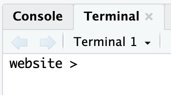

## Motivation

This is for **macOS** using the default **zsh** shell (used in macOS Catalina and later).

The command prompt on macOS doesn't look nice by default. Here's my preferred adjustment, where the prompt shows just the current folder followed by `>`.

Like this:

```         
my-folder >
```

Here's what I want the Terminal to look like on macOS (when I'm working on `website/`).

{fig-align="left" width="6in"}

And here's what I want it to look like in RStudio.

{width="2in"}

## How to Do It

Here's how to make the change:

1.  Open Terminal and run `open -a TextEdit ~/.zshrc`. This opens `~/.zshrc` in TextEdit.
2.  Add `export PS1="%1~ > "` to the bottom of the file.
3.  Save and close TextEdit.
4.  Restart Terminal or run `source ~/.zshrc` to see the new prompt.

If you ever want to reset or further customize your prompt, you can edit `~/.zshrc` again and change the `PS1` line.
