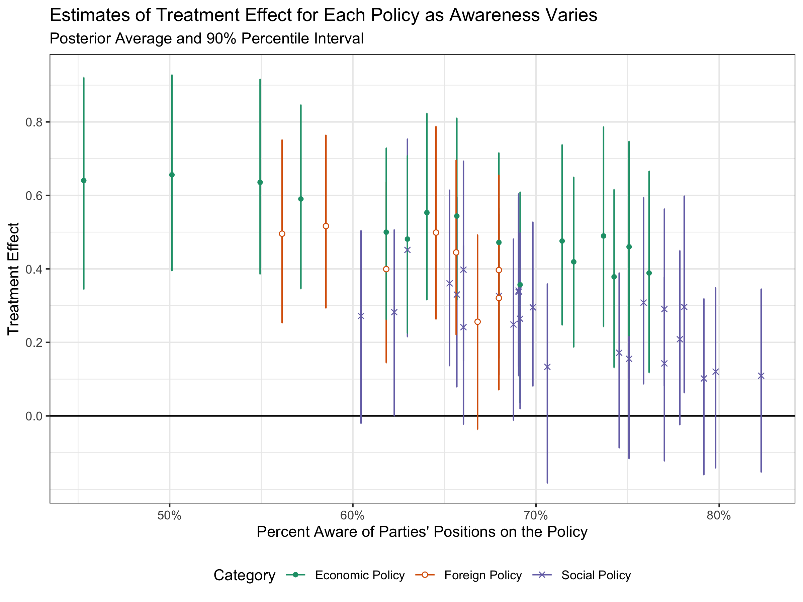
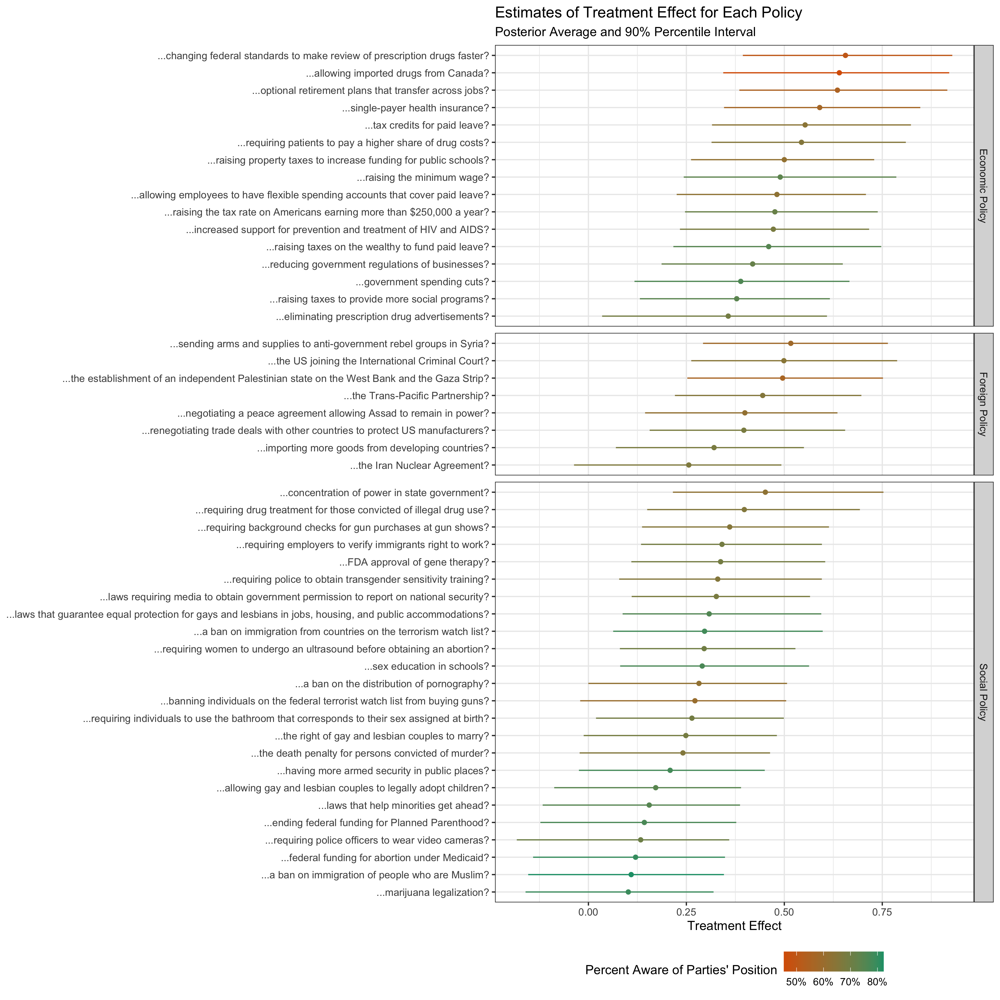

# Topic Sampling

Slides, with transitions [[Dropbox](https://www.dropbox.com/s/t6oo91ylf1686ng/gte-transitions.pdf?dl=0)] and without [[Dropbox](https://www.dropbox.com/s/t6oo91ylf1686ng/gte-transitions.pdf?dl=0)]

The two papers are below.

- Clifford, Scott, Thomas Leeper, and Carlisle Rainey. “Generalizing Survey Experiments Using Topic Sampling: An Application to Party Cues.” Forthcoming in *Political Behavior*. [[Draft](https://www.dropbox.com/s/ng0pdkvef7xgadt/manuscript_blind.docx?dl=0)]
- Clifford, Scott, Thomas Leeper, and Carlisle Rainey. “Generalizing Survey Experiments Using Topic Sampling: Theory, Evaluations, and Extensions.” [[Draft](https://www.dropbox.com/s/r1qp09i9xo76p7n/gte-details.pdf?dl=0)]

